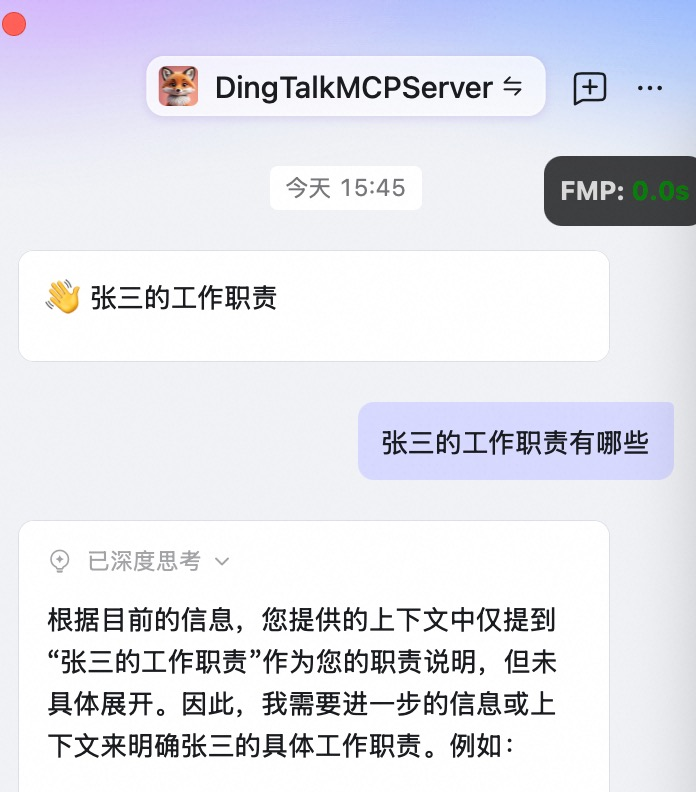

[](https://mseep.ai/app/miechalzhao-dingtalkmcpserver)

# DINGTALK MCP - 通过钉钉客户端AI助理调用本地私有部署的MCP服务

**将仓库导入python IDE工程即可启动运行，无需远端部署**

##主要功能介绍

- 钉钉AI助理直通模式与本地服务通信
- 支持多模型配置的MCP协议
- 支持本地化运行的MCP Service

<div align="center">
  
  <br>
  <em>会话功能</em>
</div>


## 项目目录结构

```
[
  '|-- Project',
  '    |-- README.md',
  '    |-- main.py',
  '    |-- app',
  '        |-- api',
  '        |   |-- __init__.py',
  '        |   |-- dingtalk_client.py',
  '        |-- config',
  '        |   |-- __init__.py',
  '        |   |-- settings.py',
  '        |-- core',
  '        |   |-- __init__.py',
  '        |   |-- llm_service.py',
  '        |   |-- mcp_server.py',
  '        |   |-- message_service.py',
  '        |-- resource',
  '        |   |-- DingTalkAgentConfig',
  '        |   |-- conversation.jpg',
  '        |-- utils',
  '            |-- __init__.py',
  '            |-- logger.py',
  ''
]
```

## 🛠️ 自定义函数开发

在 `app/core/mcp_server.py` 文件中，可以使用 `@register_tool` 装饰器添加您自己的自定义函数:

##  环境要求

- Python > 3.10
- OpenSSL > 1.1

### 使用本地环境

1. 安装依赖:
   ```bash
   直接采用IDE import即可
   
   ```

欢迎贡献！交流！联系邮箱 miechalzhao@gmail.com


